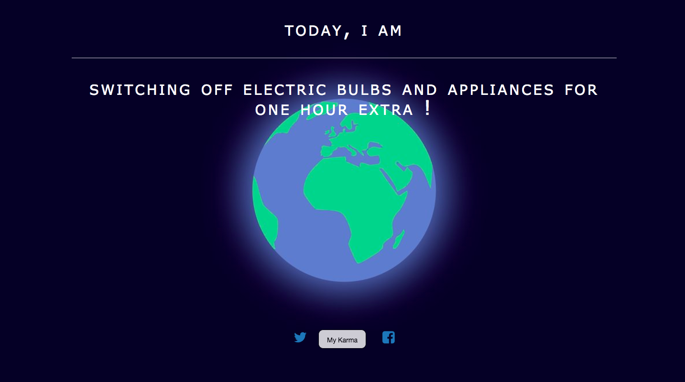

# Nature's call
 The aim of the project is as simple as it looks, Take any of the statements as the statement of the day and follow it and also share on social media so that little contribution from thousands will make a significant difference to protect our beautiful nature


This project has been deployed on Google app engine and hosted at www.trendzingo.com

it works with mysql db


```
git clone https://github.com/amit2rockon/myearth.git

cd myearth

pip install -r requirements.txt

pip install -r requirements-vendor.txt

source env/bin/activate

python manage.py runserver

```

if you got any issue while running it locally then feel free to add an issue .

feel free to contribute.


result:




I have not worked with it's security aspects : so if you find any then raise an issue

## Author

<table>
<tr>
<td>


        Amit Kumar

<p align="center">
<a href = "https://github.com/amit2rockon"></a>
<a href = "https://twitter.com/amit2rockon7"></a>
<a href = "https://www.linkedin.com/in/amit2rockon/"></a>
</p>
</td>
</tr>
</table>
